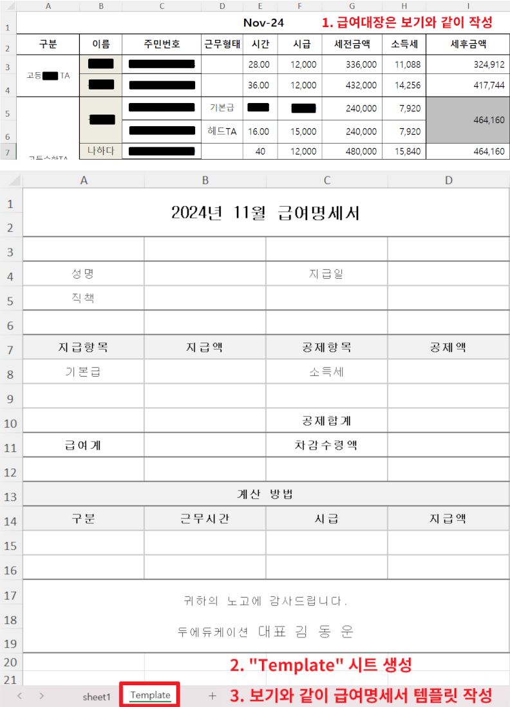

# PaystubClerk
Program to generate payslip from payroll ledger
 
 
급여대장으로부터 급여명세서를 생성하는 프로그램
 
 

 

### 필요한 패키지 파일
openpyxl  
tkinter
 
 

### 파일 빌드
##### 콘솔을 관리자 권한으로 실행 해야 한다
`pyinstaller.exe --onefile --windowed --add-data "./manual.png;." --noconsole -n=PaystubClerk --icon=payst.ico paystubclerk.py`
